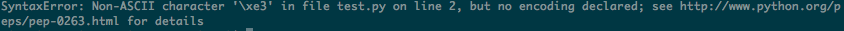

## pythonの始め方

エディタを開いて、この文字を打ち込んでみよう。

```python
print('hello')
```

できたら、 ``hello.py`` という名前で保存してね。

じゃあ、さっそく、この ``hello.py`` を動かしてみよう。
ターミナルにコマンドを入れてね。

```bash
python hello.py
```

これは ``python`` で ``hello.py`` を動かして、という意味だよ。
コマンドを入れおわったらエンターキーを押してみて。

ターミナルの次の行に ``hello`` と出たかな？
出ていたら、pythonを始める準備はOKだよ。

何かちがう文字が出たら手を上げてメンターを呼んでね。

## 言葉を表示する

何か言葉を表示してほしいとき、pythonでは ``print`` という命令を使うよ。
さっきも使ったよね。

表示してほしい言葉は、 ``print`` の後に ``(`` と ``)`` で囲んで入れるよ。

表示してほしい言葉は人間用の言葉（人間が読んでわかる言葉）だよね？
人間用の言葉をプログラムの中に書くときは、コンピューターがコンピューターへの命令と
かんちがいしないように、 ``'`` の中に囲もう。

たとえば、こんな感じ。

```python
print('nagoya')
```

``nagoya`` って表示されたかな？

じゃあ、いろいろな言葉を表示してみよう。
言葉の内容はなんでもいいよ。好きな言葉を入れてみてね。

## 日本語の言葉を表示する

いろいろな言葉を入れてみたかな？

もしかして、命令した言葉と違う変な英語がいっぱい出てきたかもしれないね。
たとえば、こんな風に。

```python
print('こんにちは')
```




```python
# coding: utf-8

print('こんにちは')
```
